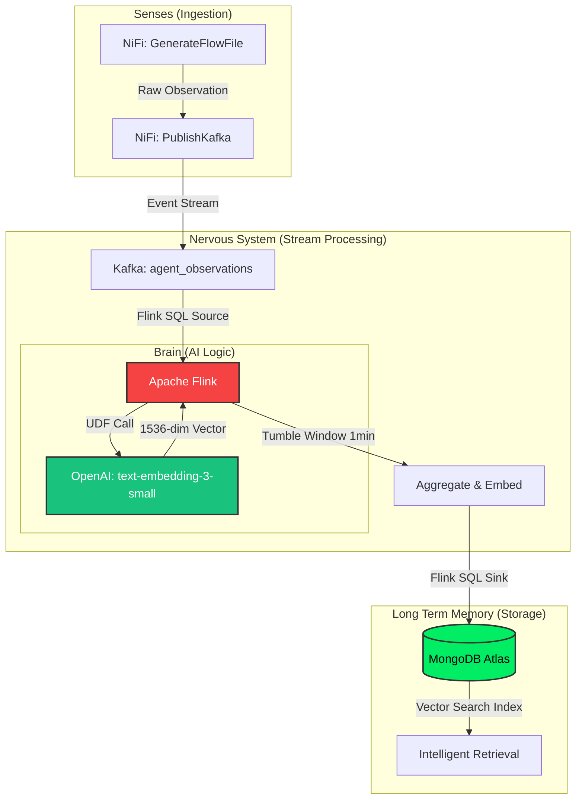

# PoC 2.0: The Agentic Data Nervous System 🧠⚡

An enterprise-grade, real-time streaming architecture designed to feed high-velocity, vectorized context to autonomous AI Agents with sub-second latency.


## 📖 Overview
Standard RAG (Retrieval-Augmented Generation) relies on static, batch-loaded databases, creating a "memory lag" for AI applications. This project demonstrates a **Data Nervous System** that bridges the gap between raw data streams and LLM inference. By leveraging **Apache Flink's** stateful processing and **MongoDB Atlas Vector Search**, this architecture provides AI agents with continuous, real-time context.

## 🚀 The Architecture

1. **The Senses (Ingestion - Apache NiFi 2.x):** - Handles multi-source data ingestion, cleansing, and dynamic deduplication before routing to the streaming layer.
2. **The Nervous System (Transport - Confluent Cloud/Kafka):** - Provides a durable, highly-available event backbone using Exactly-Once Semantics (EOS).
3. **The Brain (Processing - Apache Flink 2.2):** - Executes tumbling windows for behavioral sessionization and performs **in-stream vectorization** by calling OpenAI embedding models directly via Flink SQL.
4. **The Memory (Storage - MongoDB Atlas):** - Serves as the Vector Database sink, enabling semantic search and "Agentic Reflection" via `dotProduct` similarity.



## 📂 Repository Structure

* `/nifi` - JOLT transforms and flow definitions for raw data ingestion.
* `/flink_sql` - The core Flink SQL logic for stream-to-vector transformations.
* `/mongodb` - Infrastructure-as-Code for the Atlas Vector Search index.
* `docker-compose.yml` - Local environment setup for the NiFi/Kafka stack.

## 🛠️ Tech Stack
* **Streaming & Compute:** Apache Kafka, Confluent Cloud, Apache Flink 2.2
* **Ingestion:** Apache NiFi 2.x
* **Database & AI:** MongoDB Atlas (Vector Search), OpenAI Embeddings, Agentic RAG Frameworks

## ⚙️ Quick Start
*(Deployment instructions using Docker Compose and Confluent Cloud coming soon...)*

## How to Run
1. #### Environment Setup
   Ensure your ```.env``` file contains your ```OPENAI_API_KEY``` and MongoDB Atlas connection strings.

2. #### Start Infrastructure
   Build and launch the containers:

```bash
   docker compose build --no-cache
   docker compose up -d
```
3. #### Initialize Kafka Topics
   If the topics do not exist, create them manually (or start NiFi to auto-create):
```bash
  docker exec -it local-mock-broker /opt/kafka/bin/kafka-topics.sh --create \
  --topic agent_observations \
  --bootstrap-server localhost:9092 \
  --partitions 1 \
  --replication-factor 1
  ```
4. #### Launch Flink SQL Pipeline
   Run the SQL client with the necessary Python environment flags and initialization scripts:
```bash
  docker compose run --rm sql-client ./bin/sql-client.sh \
  -Drest.address=jobmanager \
  -l /opt/flink/sql \
  -Dpython.executable=/usr/bin/python3 \
  -Dpython.client.executable=/usr/bin/python3 \
  -i /opt/flink/sql/01_source_tables.sql \
  -i /opt/flink/sql/02_ai_model.sql

```
5. ### Start the AI Function & Pipeline
   Inside the Flink SQL prompt, register the UDF and fire the ```INSERT``` job:

```SQL
-- Register the AI Logic
CREATE TEMPORARY SYSTEM FUNCTION get_embedding 
AS 'embeddings.get_openai_embedding' 
LANGUAGE PYTHON;

-- Start the Long-Term Memory Pipeline
INSERT INTO vector_memory
SELECT 
    agent_id, 
    window_start, 
    'Summary: ' || LISTAGG(observation, ' | ') as behavior_summary,
    get_embedding('Summary: ' || LISTAGG(observation, ' | '))
FROM TABLE(
    TUMBLE(TABLE raw_agent_context, DESCRIPTOR(event_time), INTERVAL '1' MINUTE)
)
GROUP BY window_start, window_end, agent_id;
```
### Vector Search Index (MongoDB Atlas)
To enable retrieval, create a Search Index in Atlas with the following JSON:
```JSON
{
  "fields": [
    {
      "numDimensions": 1536,
      "path": "vector",
      "similarity": "cosine",
      "type": "vector"
    }
  ]
}


```

